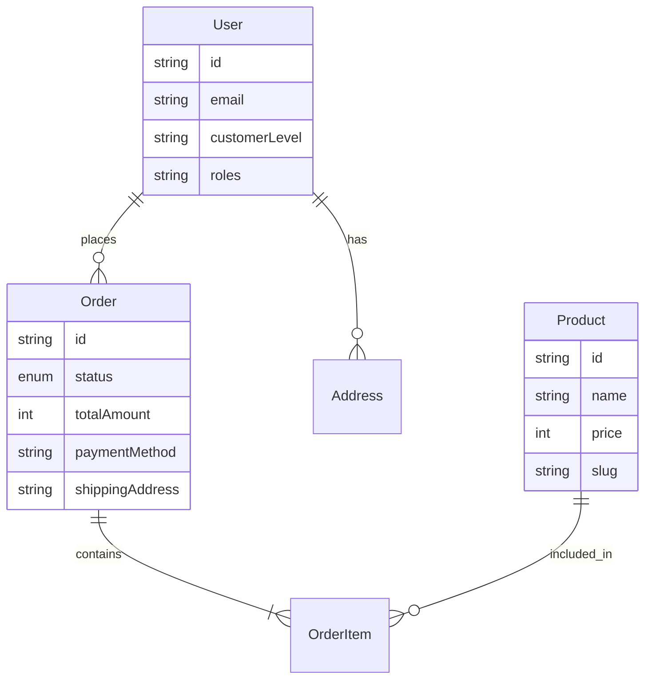

# Tài liệu Phân tích Nghiệp vụ (Business Analysis)

## 1. Tổng quan sản phẩm
Dự án là một ứng dụng **E-commerce Client (Storefront)** xây dựng trên Next.js, phục vụ người dùng cuối (Customer) mua sắm trực tuyến.
- **Mục tiêu**: Cung cấp giao diện mua sắm, quản lý giỏ hàng, đặt hàng và quản lý tài khoản cá nhân.
- **Giá trị**: Trải nghiệm người dùng mượt mà với tính năng xác thực bảo mật (Auth flow), tìm kiếm sản phẩm và quy trình thanh toán đơn giản.
- **Phạm vi**: 
    - **In-scope**: Browsing sản phẩm, Authentication (Login/Register), Cart Management, Checkout, User Profile (Info, Address, Orders).
    - **Out-of-scope (trong repo này)**: Admin Dashboard (quản lý sản phẩm/đơn hàng chi tiết cho nhân viên), CMS, Payment Gateway Integration (xử lý thanh toán thực tế, hiện tại chỉ là UI/Mock).

## 2. Bối cảnh nghiệp vụ & thuật ngữ

| Thuật ngữ | Định nghĩa | Ghi chú |
| :--- | :--- | :--- |
| **Customer (User)** | Người dùng cuối mua sắm trên hệ thống. | Có phân cấp `customerLevel`. |
| **Auth Token** | JWT dùng để xác thực API requests. | Lưu song song Cookie & LocalStorage. |
| **COD** | Cash On Delivery - Thanh toán khi nhận hàng. | Phương thức thanh toán mặc định. |
| **SKU/Slug** | Mã định danh/Đường dẫn thân thiện của sản phẩm. | Dùng trong routing URL. |
| **Default Address** | Địa chỉ giao hàng mặc định của user. | Được ưu tiên chọn khi checkout. |

## 3. Actor & Phân quyền

### Các loại người dùng
1. **Guest (Khách vãng lai)**
   - **Mục đích**: Tìm kiếm, xem sản phẩm, thêm vào giỏ hàng (giỏ hàng local hoặc yêu cầu đăng nhập tùy rule - *cần kiểm chứng thêm hành vi cart khi chưa login*).
   - **Quyền**: Xem các trang public (`/`, `/products`, `/about`), Đăng ký, Đăng nhập.
2. **Authenticated User (Khách hàng thành viên)**
   - **Mục đích**: Mua hàng, theo dõi đơn hàng, quản lý thông tin cá nhân.
   - **Quyền**: 
     - Truy cập `/cart` (full features), `/checkout`.
     - Truy cập khu vực cá nhân: `/account` (Profile, Orders, Addresses).
     - Bị chặn truy cập lại trang `/login`, `/register`.

> **Lưu ý**: Hệ thống có role `Admin` trong `User` model, nhưng repo này không chứa giao diện quản trị viên (chặn bởi middleware hoặc không có route).

## 4. Các module/tính năng chính

| Module | Mô tả | Điểm vào chính (UI/Route) |
| :--- | :--- | :--- |
| **Authentication** | Đăng ký, Đăng nhập, Logout, Refresh Token. | `/login`, `/register` |
| **Catalog** | Danh sách sản phẩm, Chi tiết, Tìm kiếm, Gợi ý. | `/`, `/products`, `/[categorySlug]` |
| **Shopping Cart** | Quản lý giỏ hàng (Thêm/Sửa/Xóa/Mã giảm giá). | `/cart` |
| **Checkout** | Quy trình thanh toán, chọn địa chỉ, phương thức TT. | `/checkout` |
| **Account** | Quản lý hồ sơ, địa chỉ, lịch sử đơn hàng. | `/account` |

## 5. Use cases (Điển hình)

### Actor: Authenticated User

#### UC1: Đặt hàng (Checkout)
- **Tiền điều kiện**: Giỏ hàng có sản phẩm, User đã đăng nhập.
- **Luồng chính**:
  1. User vào `/checkout`.
  2. Hệ thống load thông tin User (Tên, Email, SĐT) vào form.
  3. User nhập/chọn Địa chỉ giao hàng (Tỉnh/Thành, Quận/Huyện, Phường/Xã).
  4. User chọn Phương thức thanh toán (COD/Bank/Momo/Card).
  5. User nhấn "Đặt hàng".
  6. Hệ thống tạo đơn hàng (`CreateOrderRequest`).
  7. Success -> Chuyển hướng về chi tiết đơn hàng `/account/orders/{id}`.
- **Business Rules**:
  - Phí ship: **30,000 VND** cho đơn < 500,000 VND. **Freeship** cho đơn >= 500,000 VND.
  - Form bắt buộc: Tên, Email, SĐT, Địa chỉ đầy đủ.

#### UC2: Quản lý Địa chỉ (Address Book)
- **Luồng chính**:
  1. Vào `/account`, chọn tab "Địa chỉ".
  2. Xem danh sách địa chỉ đã lưu.
  3. Thêm mới hoặc Sửa địa chỉ (Set default).
  4. Xóa địa chỉ không còn dùng.
- **Quy tắc**: Cho phép thiết lập 1 địa chỉ làm "Mặc định".

## 6. Thực thể & Dữ liệu nghiệp vụ

### Entity Diagram (Basic)

### Trạng thái Đơn hàng (Order Status)
Dựa trên `types/order.ts`, đơn hàng có chu trình khép kín:
1. **Pending (0)**: Mới tạo.
2. **Processing (1)**: Đang xử lý.
3. **Shipped (2)**: Đã giao cho vận chuyển.
4. **Delivered (3)**: Giao thành công.
5. **Cancelled (4)**: Đã hủy.
6. **Returned (5)**: Trả hàng.

## 7. Business Rules Tổng hợp

### Quy tắc Vận chuyển & Thanh toán
- **Nguồn**: `app/(routes)/checkout/page.tsx`
- **Rule**:
  - `Shipping Cost`: 0 VND nếu Subtotal > 500,000 VND.
  - `Shipping Cost`: 30,000 VND nếu Subtotal <= 500,000 VND.
- **Phương thức thanh toán**: Hệ thống hỗ trợ hiển thị 4 loại (COD, Banking, MoMo, Credit) nhưng về mặt xử lý backend, hiện tại flow chính vẫn là tạo đơn hàng và ghi nhận phương thức (chưa thấy tích hợp SDK thanh toán online trực tiếp tại client step này, chủ yếu là xác nhận order).

### Quy tắc Bảo mật & Phiên làm việc
- **Nguồn**: `middleware.ts`, `services/auth-service.ts`
- **Rule**:
  - Token được lưu đồng bộ ở cả **Cookie** và **LocalStorage**.
  - `Middleware` ưu tiên check cookie để redirect server-side.
  - Access Token có hạn 1 ngày, Refresh Token 7 ngày.

## 8. Luồng End-to-End Điển hình

### Luồng: Mua hàng thành công (Happy Path)
1. **Login**: User đăng nhập tại `/login`. Token được set.
2. **Browse**: User xem sản phẩm tại `/products`.
3. **Add to Cart**: User chọn màu/size, bấm "Thêm vào giỏ". `CartService` gọi API cập nhật giỏ.
4. **View Cart**: User kiểm tra lại tại `/cart`, có thể nhập mã giảm giá (`applyPromoCode`).
5. **Checkout**:
   - User nhập thông tin giao hàng.
   - Hệ thống tính phí ship tự động (0đ hoặc 30k).
   - User chọn "COD".
   - Submit -> API trả về OrderID.
6. **Post-Purchase**: User được redirect đến trang chi tiết đơn hàng để xem lại.

## 9. Các điểm chưa rõ / Giả định
- **Giỏ hàng Guest**: Chưa rõ cơ chế lưu giỏ hàng cho khách chưa đăng nhập (dùng local storage hay session?). Code `useCart` cần check kỹ hơn nếu muốn xác nhận, nhưng giả định hiện tại là cần login để checkout.
- **Admin**: Không thấy mã nguồn Admin Dashboard trong repo này, giả định đây là repo tách rời (Micro-frontend hoặc Client-only).
- **Payment Integration**: Các nút Momo/Credit hiện tại chỉ mang tính chất lựa chọn (ghi nhận vào DB) hay có redirect sang cổng thanh toán? (Code `checkout/page.tsx` chỉ gọi `createOrder`, chưa thấy redirect payment URL).

## 10. Backlog gợi ý (Cải tiến)
- [ ] **Validation**: Thêm validate định dạng số điện thoại VN cụ thể hơn (regex).
- [ ] **UX**: Thêm step xác nhận (Review Order) trước khi Submit final.
- [ ] **Feature**: Cho phép Guest Checkout (đặt hàng không cần đăng nhập).
- [ ] **Payment**: Tích hợp SDK thanh toán thực tế (VNPAY, MoMo IPN).
