# Báo Cáo Đánh Giá UI/UX ShopViet E-Commerce

**Ngày đánh giá:** 10 tháng 1, 2026  
**Ứng dụng:** ShopViet E-Commerce Client  
**URL:** http://localhost:3000

---

## Tóm Tắt

Tài liệu này ghi nhận kết quả đánh giá UI/UX toàn diện của nền tảng thương mại điện tử ShopViet. Đánh giá bao gồm tất cả các trang chính trong cả chế độ **Sáng** và **Tối**, xác định điểm mạnh về thiết kế, vấn đề khả dụng và các lĩnh vực cần cải thiện.

### Kết Quả Chính
- ✅ **Thiết kế hiện đại, tinh tế** với phong cách nhất quán trên hầu hết các trang
- ✅ **Hỗ trợ theme xuất sắc** với chuyển đổi Sáng/Tối mượt mà
- ✅ **Trang Giới thiệu và Liên hệ** hoạt động bình thường
- ⚠️ **Thiếu nút chuyển theme** trên trang đăng nhập/đăng ký
- ⚠️ **Tính năng So sánh chưa hoàn thiện** - chuyển hướng về trang Sản phẩm

---

## Các Trang Đã Đánh Giá

### 1. Trang Chủ

Trang chủ có bố cục thương mại điện tử hiện đại với phần hero, sản phẩm nổi bật và điều hướng danh mục.

| Chế độ Tối | Chế độ Sáng |
|------------|-------------|
|  | 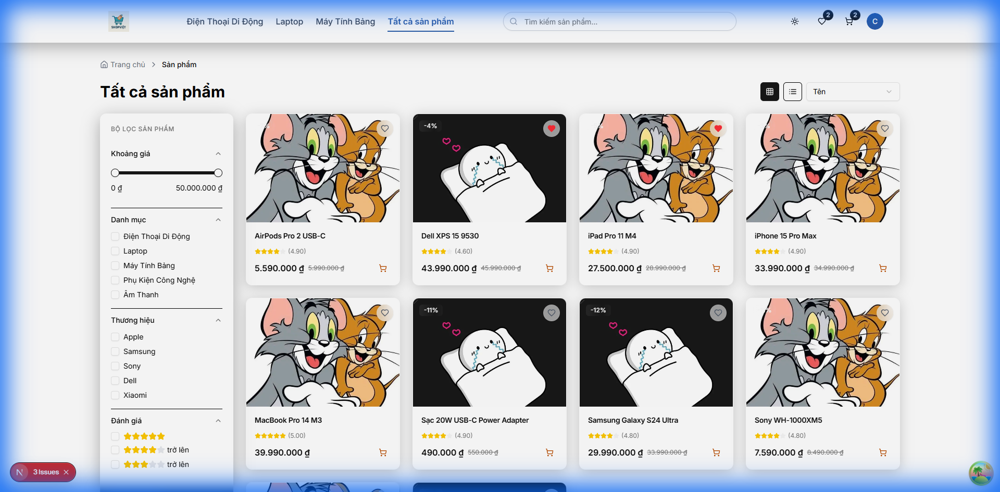 |

**Tính năng bố cục:**
- Điều hướng header theo danh mục (Điện thoại, Laptop, Máy tính bảng)
- Thanh tìm kiếm trung tâm với phong cách hiện đại
- Nút chuyển theme với các tùy chọn Sáng/Tối/Hệ thống
- Icon Yêu thích và Giỏ hàng với badge số lượng
- Menu dropdown hồ sơ người dùng

---

### 2. Trang Xác Thực

#### Trang Đăng Nhập

| Chế độ Sáng | Chế độ Tối |
|-------------|------------|
| 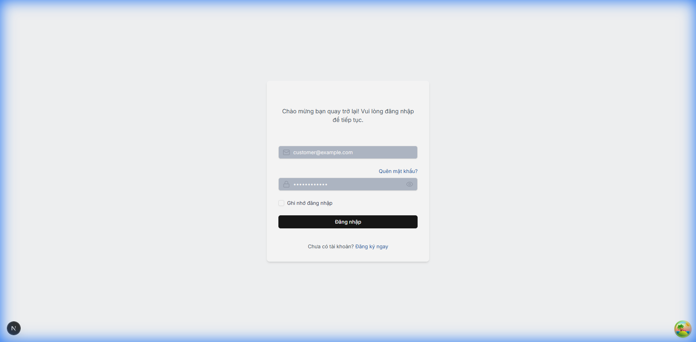 | 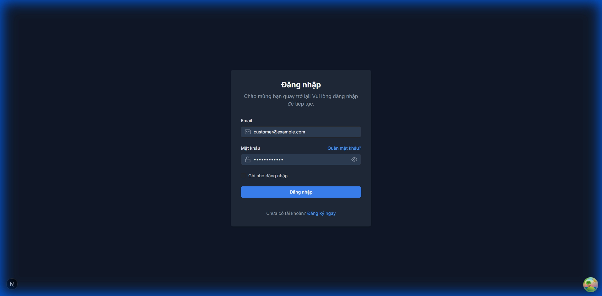 |

**Bố cục:**
- Thiết kế card trung tâm với hiệu ứng phát sáng xanh
- Trường Email và Mật khẩu với nút hiển thị/ẩn
- Checkbox "Ghi nhớ đăng nhập" và link "Quên mật khẩu"
- Nút "Đăng nhập" chính

#### Trang Đăng Ký

| Chế độ Sáng | Chế độ Tối |
|-------------|------------|
| 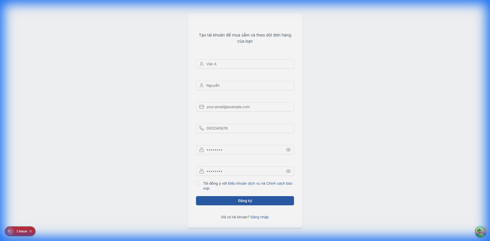 | 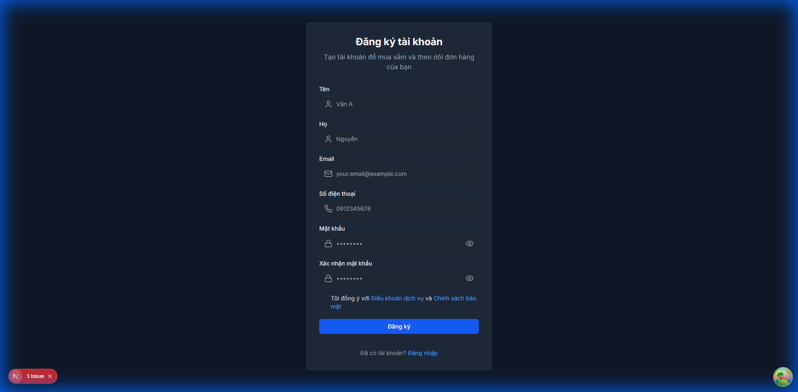 |

**Bố cục:**
- Trường Họ, Tên, Email, Số điện thoại
- Mật khẩu và Xác nhận mật khẩu với nút hiển thị
- Checkbox điều khoản và điều kiện
- Nút "Đăng ký" chính

> ⚠️ **Vấn đề:** Header với nút chuyển theme không xuất hiện trên trang Đăng nhập và Đăng ký. Người dùng không thể chuyển theme cho đến khi đăng nhập.

---

### 3. Trang Sản Phẩm

#### Danh Sách Sản Phẩm

| Chế độ Sáng | Chế độ Tối |
|-------------|------------|
|  | 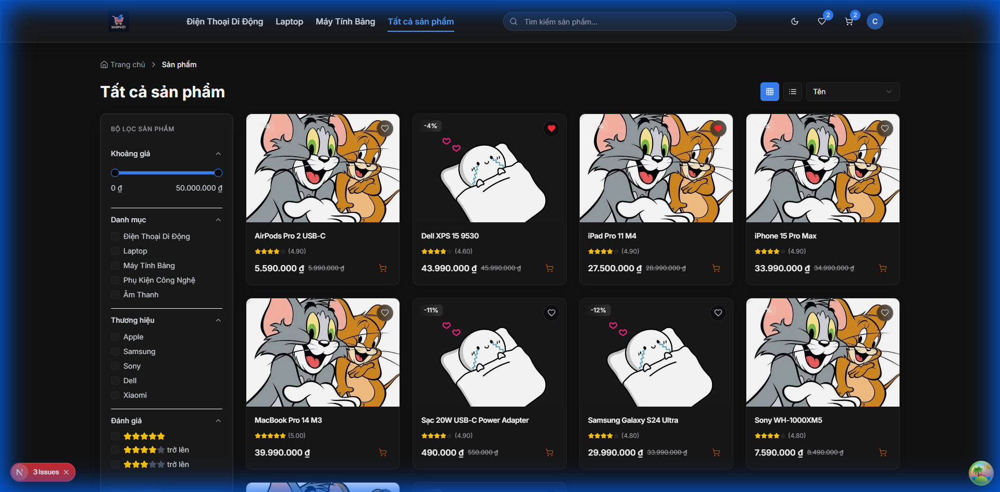 |

**Tính năng bố cục:**
- **Bộ lọc sidebar trái:** Thanh trượt khoảng giá, Danh mục, Thương hiệu, Đánh giá
- **Thanh công cụ header:** Breadcrumbs, Chế độ xem (Lưới/Danh sách), Dropdown sắp xếp
- **Card sản phẩm:** Badge giảm giá, nút yêu thích, bo góc, phân cấp giá rõ ràng

#### Chi Tiết Sản Phẩm

| Chế độ Sáng | Chế độ Tối |
|-------------|------------|
| 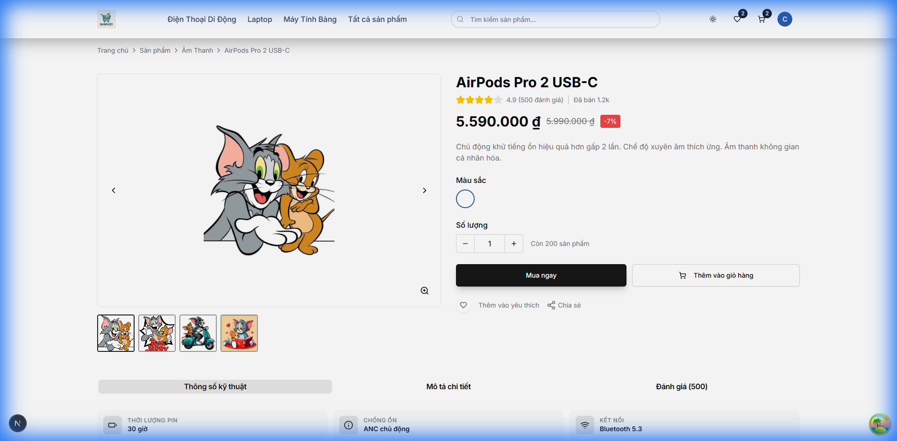 | 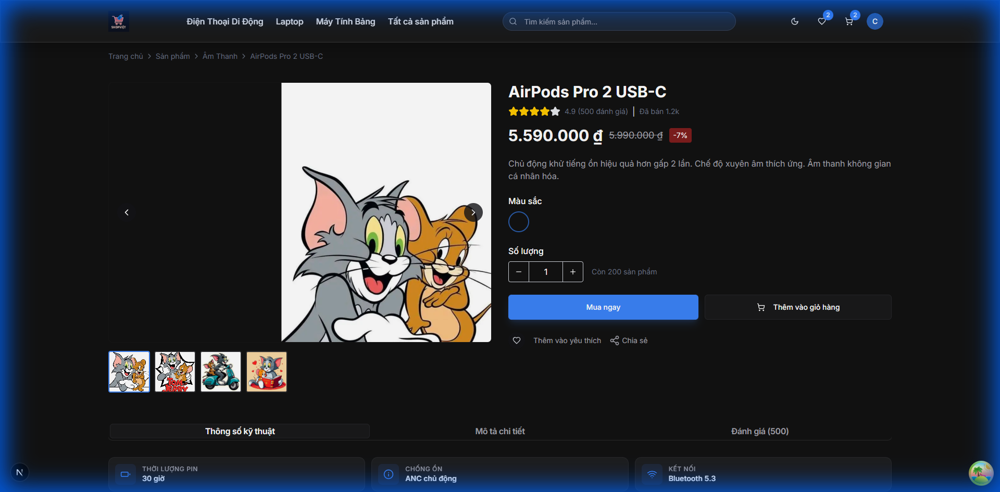 |

**Tính năng bố cục:**
- **Thư viện ảnh:** Ảnh chính với dải thumbnail
- **Thông tin sản phẩm:** Tên, đánh giá sao, giá với phần trăm giảm
- **Tùy chọn:** Chọn màu sắc, Điều chỉnh số lượng
- **Hành động:** Nút "Mua ngay" và "Thêm vào giỏ hàng"
- **Tab:** Thông số kỹ thuật, Mô tả, Đánh giá

---

### 4. Quy Trình Mua Hàng

#### Trang Giỏ Hàng

| Chế độ Sáng | Chế độ Tối |
|-------------|------------|
| 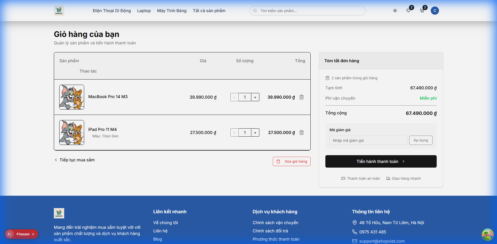 | 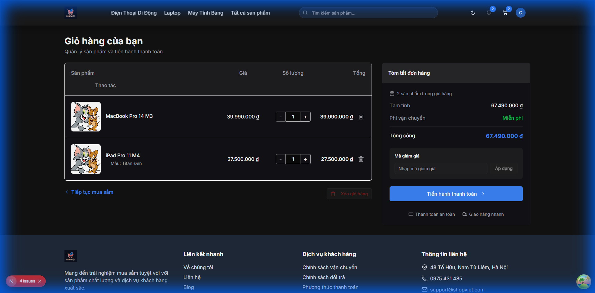 |

**Tính năng bố cục:**
- Danh sách sản phẩm với ảnh, tên, biến thể, giá, điều chỉnh số lượng
- Card tóm tắt đơn hàng với tổng phụ, phí vận chuyển, ô nhập mã giảm giá
- Nút "Tiếp tục mua sắm" và "Xóa giỏ hàng"
- Nút chính "Tiến hành thanh toán"

#### Trang Thanh Toán

| Chế độ Sáng | Chế độ Tối |
|-------------|------------|
| 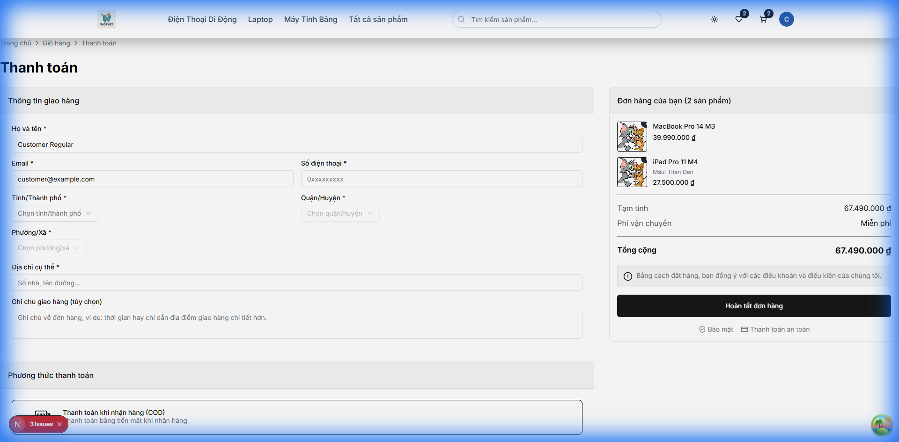 | 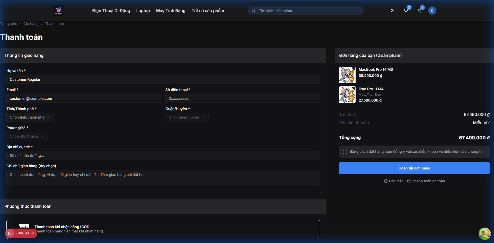 |

**Tính năng bố cục:**
- **Bố cục hai cột**
- **Form giao hàng:** Họ tên, Email, SĐT, Tỉnh/Quận/Phường, Địa chỉ chi tiết, Ghi chú
- **Phương thức thanh toán:** Hiển thị tùy chọn COD
- **Tóm tắt đơn hàng:** Danh sách sản phẩm, tổng tiền, nút "Hoàn tất đơn hàng"

---

### 5. Trang Tài Khoản

#### Bảng Điều Khiển Tài Khoản

| Chế độ Sáng | Chế độ Tối |
|-------------|------------|
| 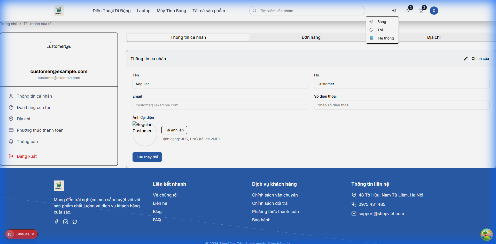 | 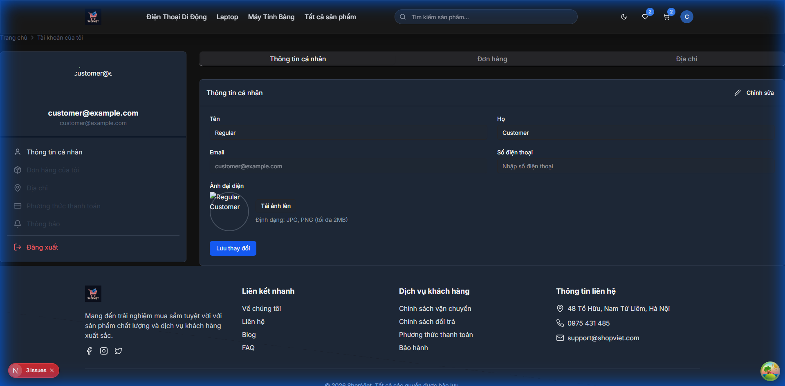 |

**Tính năng bố cục:**
- Sidebar trái cố định với tóm tắt hồ sơ người dùng
- Điều hướng: Thông tin cá nhân, Đơn hàng, Địa chỉ, Thanh toán, Thông báo, Đăng xuất
- Khu vực nội dung dạng card với tab inline
- Form thông tin cá nhân (Tên, Email, SĐT)

#### Trang Đơn Hàng

| Chế độ Sáng | Chế độ Tối |
|-------------|------------|
| 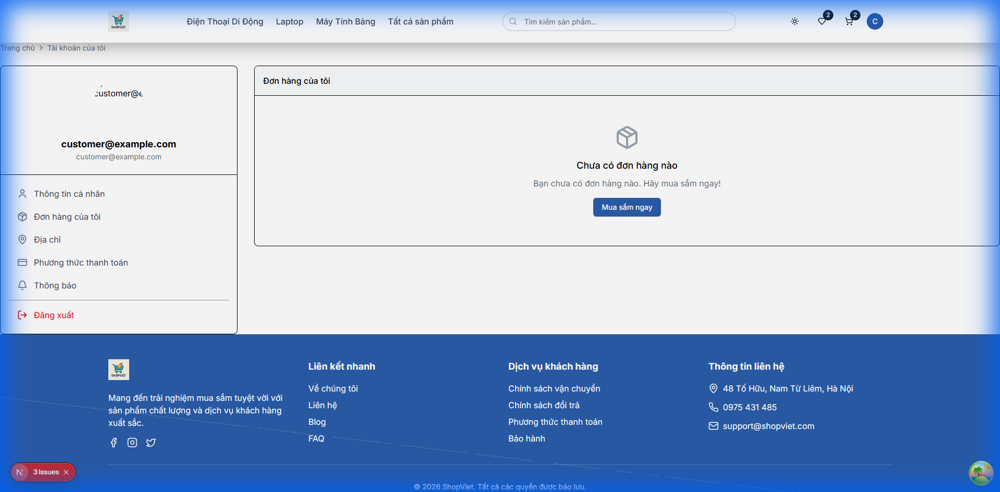 | 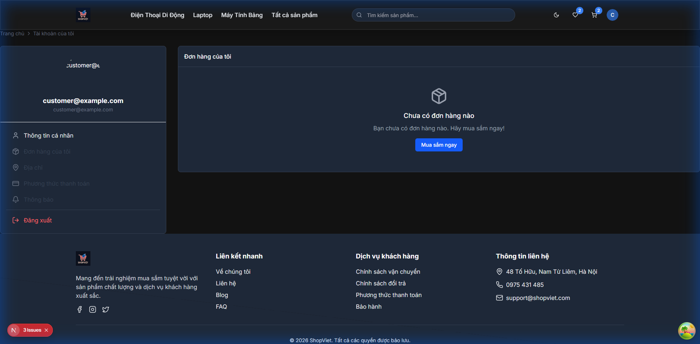 |

**Bố cục:** Trạng thái trống với icon gói hàng và nút CTA "Mua sắm ngay".

#### Trang Địa Chỉ

| Chế độ Sáng | Chế độ Tối |
|-------------|------------|
| 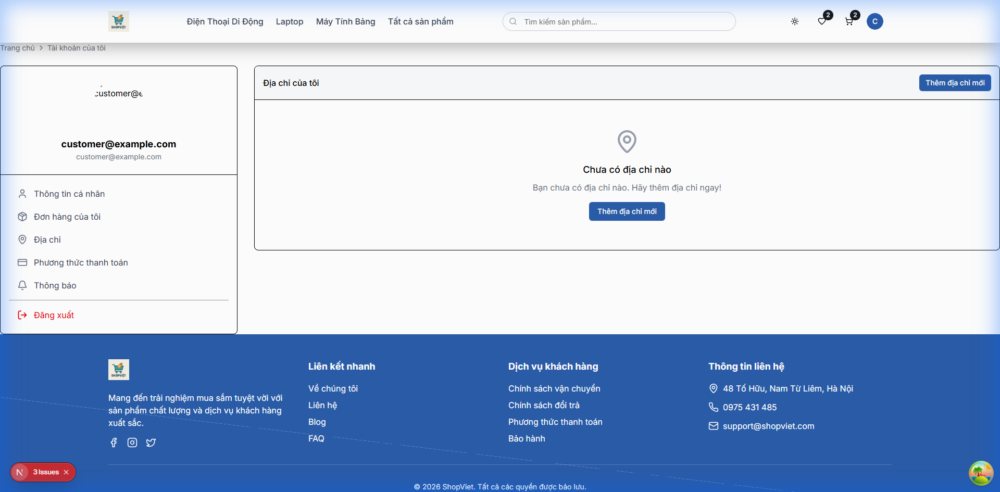 | 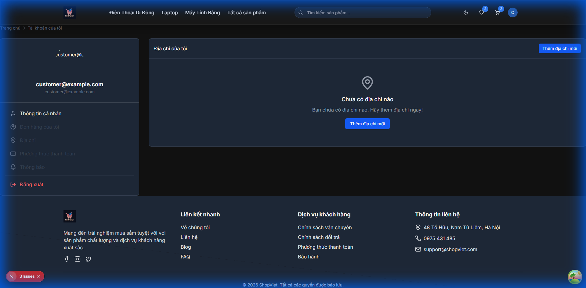 |

**Bố cục:** Trạng thái trống với icon bản đồ và nút "Thêm địa chỉ mới".

---

### 6. Trang Yêu Thích

| Chế độ Sáng | Chế độ Tối |
|-------------|------------|
| 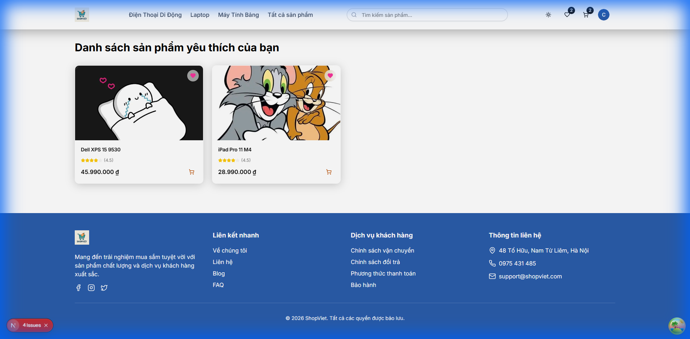 | 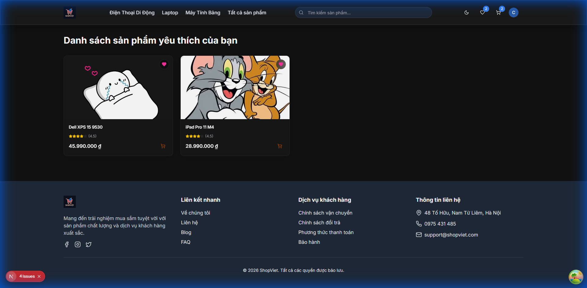 |

**Tính năng bố cục:**
- Tiêu đề rõ ràng "Danh sách sản phẩm yêu thích của bạn"
- Card sản phẩm dạng lưới với nút xóa (icon trái tim)
- Ảnh sản phẩm, tên, đánh giá, nút "Thêm vào giỏ hàng"

> ℹ️ **Ghi chú:** Icon trái tim được dùng để xóa có thể gây nhầm lẫn. Người dùng thường mong đợi icon thùng rác hoặc X cho hành động xóa.

---

### 7. Trang So Sánh

| Chế độ Tối | Chế độ Sáng |
|------------|-------------|
| 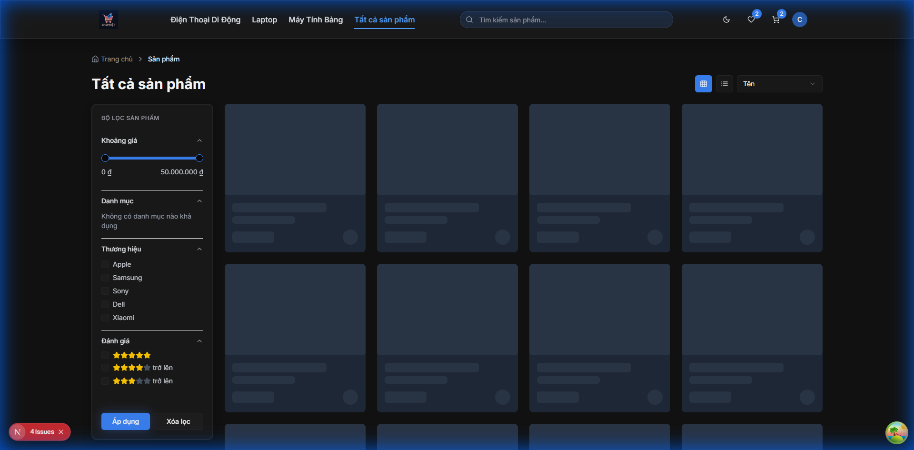 | 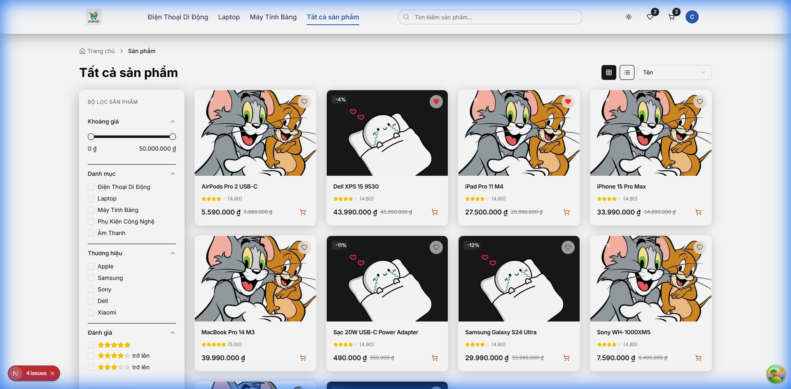 |

> ⛔ **Tính năng chưa hoàn thiện:** Route `/compare` chuyển hướng về `/products` mà không có trạng thái trống hoặc giải thích. Không có nút "Thêm vào so sánh" trên card sản phẩm.

---

### 8. Trang Giới Thiệu & Liên Hệ

| Trang Giới thiệu | Trang Liên hệ |
|------------------|---------------|
| 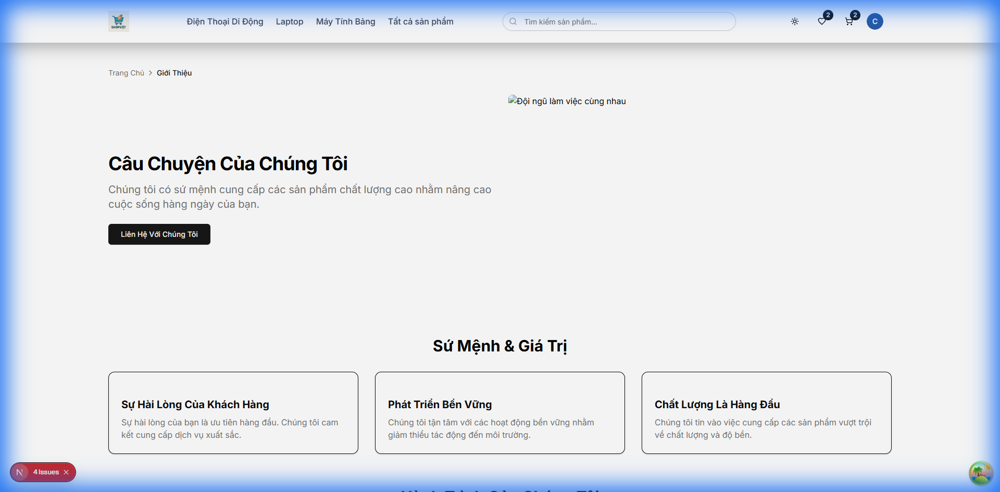 | 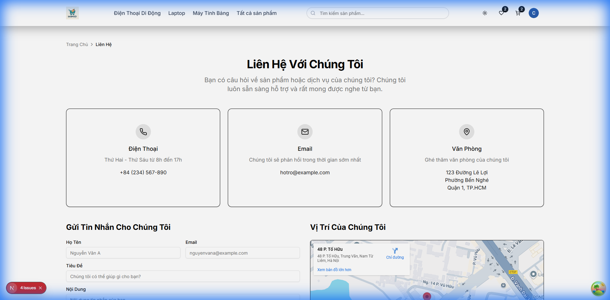 |

**Trang Giới thiệu:**
- Phần "Câu Chuyện Của Chúng Tôi"
- Card "Sứ Mệnh & Giá Trị" (Sự hài lòng khách hàng, Bền vững, Chất lượng)
- Timeline "Hành Trình Của Chúng Tôi"
- Phần "Đội Ngũ Của Chúng Tôi"

**Trang Liên hệ:**
- Card kênh liên hệ (Điện thoại, Email, Văn phòng)
- Form "Gửi Tin Nhắn Cho Chúng Tôi"
- Phần "Vị Trí Của Chúng Tôi" với bản đồ
- Phần "Câu Hỏi Thường Gặp" (FAQ)

---

## Tổng Kết Các Vấn Đề

| Mức độ | Trang | Vấn đề | Trạng thái |
|--------|-------|--------|------------|
| 🟠 Cao | Đăng nhập/Đăng ký | Thiếu nút chuyển theme trong header | Cần sửa |
| 🟠 Cao | So sánh | Chuyển hướng về Sản phẩm, không có chức năng so sánh | Chưa hoàn thiện |
| 🟡 Trung bình | Tài khoản | Avatar bị méo (hình oval thay vì tròn) | Lỗi CSS |
| 🟡 Trung bình | Tài khoản | Điều hướng trùng lặp (sidebar + tabs) | Vấn đề UX |
| 🟡 Trung bình | Yêu thích | Icon trái tim cho việc xóa gây nhầm lẫn | Vấn đề UX |
| 🟢 Thấp | Tất cả | Ảnh placeholder (Tom & Jerry) cần thay thế | Nội dung |
| 🟢 Thấp | Chế độ Sáng | Viền card độ tương phản thấp | Giao diện |

---

## Đề Xuất Cải Tiến

1. **Thêm nút chuyển theme vào trang xác thực:** Thêm header đơn giản hoặc nút theme nổi
2. **Hoàn thiện tính năng So sánh:** Thêm nút "Thêm vào so sánh" và tạo trang so sánh đúng cách
3. **Sửa CSS Avatar:** Kiểm tra thuộc tính `aspect-ratio` hoặc `object-fit` trên ảnh hồ sơ
4. **Chuẩn hóa điều hướng:** Chọn một trong hai: sidebar HOẶC tabs, không dùng cả hai
5. **Cập nhật UX Yêu thích:** Dùng icon thùng rác/X cho việc xóa thay vì trái tim
6. **Thay ảnh placeholder:** Sử dụng ảnh sản phẩm thực tế trước khi đưa lên production

---

## Kết Luận

Nhìn chung, ShopViet E-Commerce có giao diện người dùng **hiện đại và chuyên nghiệp** với hỗ trợ Dark Mode tốt. Các vấn đề chính cần giải quyết là:
- Thêm theme toggle cho trang xác thực
- Hoàn thiện tính năng so sánh sản phẩm
- Sửa một số lỗi CSS nhỏ

Sau khi giải quyết các vấn đề trên, ứng dụng sẽ sẵn sàng cho môi trường production.
